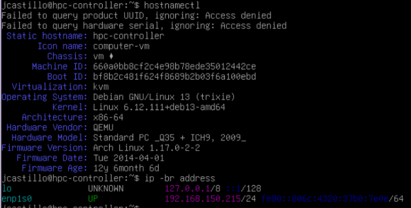
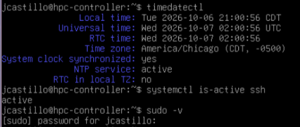
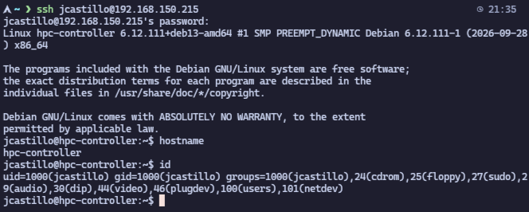
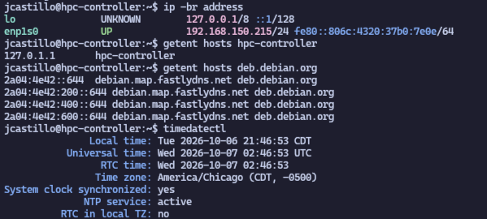
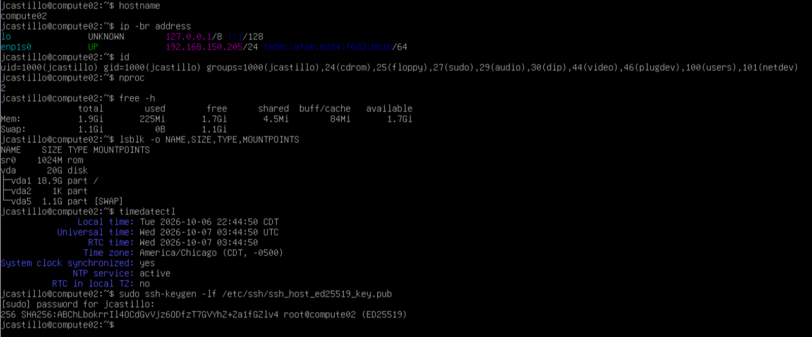
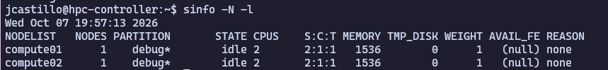
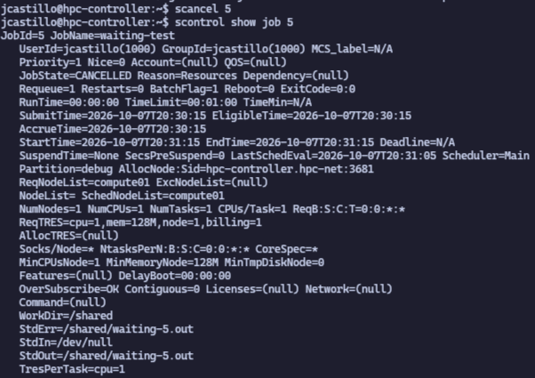
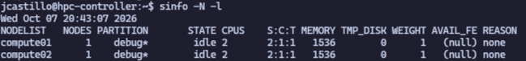
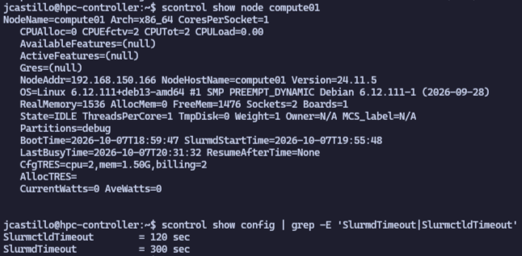
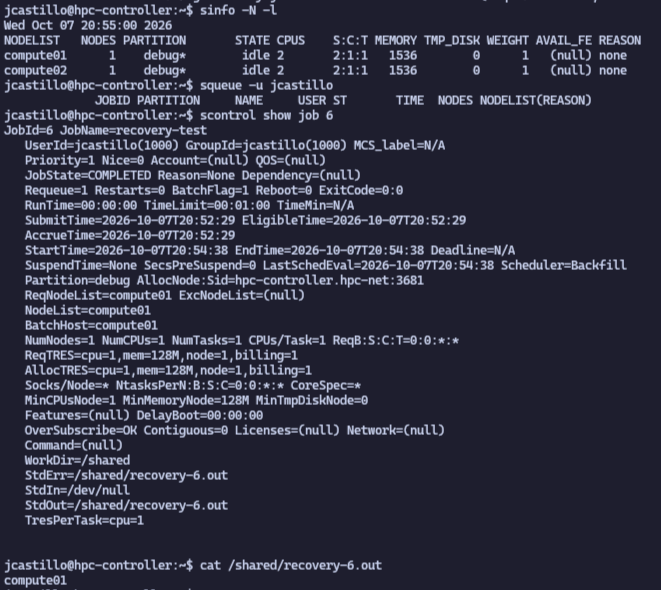

## Context

I am building a small Debian HPC lab to practice Linux administration, SLURM job scheduling, shared storage, and troubleshooting.

## Objective

Set up three Debian virtual machines: one controller and two compute nodes. The completed lab will demonstrate successful jobs, service recovery, node maintenance, a Bash health check, and a tested file restore.

## Environment

- Host: Arch Linux with KVM/libvirt.
- Network: `hpc-net`, using `192.168.150.0/24`.
- Management tool: Virtual Machine Manager.
- Installer: Debian 13.7.0 amd64 netinst

## What I Did

### 1. Added a virtual network

I added a dedicated virtual network for the HPC lab in Virtual Machine Manager with the following settings:

| Setting         | Value                               |
| --------------- | ----------------------------------- |
| Name            | `hpc-net`                           |
| Mode            | NAT                                 |
| Forward to      | Any physical device                 |
| IPv4 network    | `192.168.150.0/24`                  |
| DHCP range      | `192.168.150.128`–`192.168.150.254` |
| IPv6            | Disabled                            |
| DNS domain name | Default                             |

**[Paste screenshot of the hpc-net configuration page here.]**


### 2. Created the controller VM and installed Debian

I created `hpc-controller` in Virtual Machine Manager with 2 vCPUs, 2 GiB RAM, a 25 GiB virtual disk, and a connection to `hpc-net`.

I completed the Debian 13.7.0 graphical installer, set the hostname to `hpc-controller`, and created a regular user. I used guided partitioning with all files in one partition, selected SSH server and standard system utilities without a desktop environment, and installed GRUB.

### 3. Verified the controller's basic configuration

I used `hostnamectl` and `ip -br address` to confirm the hostname was `hpc-controller`, the system was running Debian 13, and its network interface was up with the address `192.168.150.215/24`. I also used `timedatectl` to confirm the clock was synchronized and `systemctl is-active ssh` to verify the SSH service was active.





### 4. Verified administrator access and SSH from Arch

On the controller console, I verified sudo access and displayed the SSH server's public host-key fingerprint:

```bash
sudo -v
sudo ssh-keygen -lf /etc/ssh/ssh_host_ed25519_key.pub
```

From my Arch terminal, I connected to the controller:

```bash
ssh jcastillo@192.168.150.215
```

I confirmed that the offered fingerprint matched the one displayed on the VM console before accepting the connection. After logging in, I checked the remote hostname and user identity:

```bash
hostname
id
```

The hostname was `hpc-controller`. The account was `jcastillo`, with UID `1000`, primary GID `1000`, and membership in the `sudo` group. The compute nodes will need matching user and group IDs for consistent shared-file ownership.



### 5. Checked the controller's actual resources and clock

Inside the SSH session on `hpc-controller`, I ran:

```bash
nproc
free -h
lsblk -o NAME,SIZE,TYPE,MOUNTPOINTS
timedatectl
```

| Check             | Observed result                      |
| ----------------- | ------------------------------------ |
| CPUs available    | 2                                    |
| Guest-visible RAM | 1.9 GiB total, 1.7 GiB available     |
| Virtual disk      | `vda`, 25 GiB                        |
| Root partition    | `vda1`, 23.7 GiB, mounted at `/`     |
| Swap              | 1.3 GiB, unused at inspection        |
| Time zone         | `America/Chicago`                    |
| Clock             | Synchronized, NTP active, RTC in UTC |

These checks confirmed that Debian could use the planned controller resources.

### 6. Reserved the controller's IP address

Checked the controller's network adapter and reserved `192.168.150.215` for its MAC address on the Arch host:

```bash
virsh -c qemu:///system net-update hpc-net add-last ip-dhcp-host \
  "<host mac='52:54:00:a8:4f:16' name='hpc-controller' ip='192.168.150.215'/>" \
  --live --config
```

This keeps the controller's IP consistent. The change was applied immediately and saved without restarting the network. Verified both settings with:

```bash
virsh -c qemu:///system net-dumpxml hpc-net
virsh -c qemu:///system net-dumpxml hpc-net --inactive
```

Both showed the reservation.

After rebooting the controller, I checked:

```bash
ip -br address
getent hosts hpc-controller
getent hosts deb.debian.org
timedatectl
```



The controller kept `192.168.150.215`, its hostname resolved locally, Debian's mirror name resolved, and the clock remained synchronized with NTP active. The reboot check passed.

### 7. Created compute01 with a Bash script

I ran **create-compute01.sh** from my terminal:

```bash
bash create-compute01.sh
```

```bash
#!/usr/bin/env bash
# Run from an Arch desktop terminal when ready: bash create-compute01.sh
# Creates the VM and opens the installer; Debian installation remains manual.
# Installer choices: hostname compute01, blank domain, user jcastillo,
# blank root password (sudo), guided partitioning on the new 20 GiB disk,
# SSH server and standard utilities, no desktop, and GRUB.
# Debian guide: https://www.debian.org/releases/trixie/amd64/

set -euo pipefail
export LC_ALL=C

uri='qemu:///system'
vm='compute01'
network='hpc-net'
iso='/var/lib/libvirt/images/iso/debian-13.7.0-amd64-netinst.iso'
disk='/var/lib/libvirt/images/compute01.qcow2'

fail() { printf 'Stopped: %s\n' "$*" >&2; exit 1; }

for tool in virsh virt-install virt-viewer; do
    command -v "$tool" >/dev/null || fail "Missing tool: $tool"
done
[[ -n ${DISPLAY:-}${WAYLAND_DISPLAY:-} ]] || fail 'Run from your Arch desktop terminal.'
[[ -r "$iso" ]] || fail "Cannot read installer: $iso"
[[ -r /var/lib/libvirt/images && -x /var/lib/libvirt/images ]] ||
    fail 'Cannot inspect the disk directory.'
[[ ! -e "$disk" && ! -L "$disk" ]] || fail "Disk already exists: $disk"

# Stop on libvirt errors, duplicate VM names, or an inactive network.
vm_names=$(virsh --connect "$uri" list --all --name)
while IFS= read -r existing; do
    [[ "$existing" != "$vm" ]] || fail "VM already exists: $vm"
done <<< "$vm_names"
network_info=$(virsh --connect "$uri" net-info "$network")
grep -Eq '^Active:[[:space:]]+yes$' <<< "$network_info" ||
    fail "$network is inactive. Start it in Virtual Machine Manager first."

printf 'Creating %s: 2 vCPUs, 2048 MiB RAM, new 20 GiB disk, network %s.\n' "$vm" "$network"
virt-install \
    --connect "$uri" \
    --name "$vm" \
    --virt-type kvm \
    --memory 2048 \
    --vcpus 2 \
    --osinfo debian13 \
    --disk "path=$disk,size=20,format=qcow2,bus=virtio" \
    --network "network=$network,model=virtio" \
    --cdrom "$iso" \
    --graphics spice,listen=127.0.0.1 \
    --noautoconsole

# If the viewer fails, open compute01 in Virtual Machine Manager.
# A failed install may leave its VM/disk behind; inspect before retrying.
exec virt-viewer --connect "$uri" "$vm"
```

The script creates `compute01` with 2 CPUs, 2 GiB RAM, a new 20 GiB disk, and a connection to `hpc-net`, then opens the Debian installer. It stops if the VM or disk already exists. The graphical installer opened successfully.

Graphical installation settings:

- Hostname: `compute01`; domain left blank.
- User: `jcastillo`; root password left blank to enable sudo.
- Time zone: Central.
- Partitioning: guided, entire 20 GiB disk, all files in one partition.
- Software: SSH server and standard system utilities; no desktop.
- GRUB: install to `/dev/vda`.

### 8. Verified compute01

After installation and reboot, `hostname`, `ip -br address`, and `id` confirmed `compute01` was running at `192.168.150.166`, with user `jcastillo` and UID/GID `1000` matching the controller.

I compared the SSH host-key fingerprint with the VM console and successfully logged in from Arch using `ssh jcastillo@192.168.150.166`.

`nproc`, `free -h`, `lsblk`, and `timedatectl` confirmed 2 CPUs, 1.9 GiB usable RAM, a 20 GiB disk, and a synchronized clock with NTP active.

Then reserved the node's current IP from the Arch host:

```bash
virsh -c qemu:///system net-update hpc-net add-last ip-dhcp-host \
  "<host mac='52:54:00:34:be:66' name='compute01' ip='192.168.150.166'/>" \
  --live --config
```

The reservation was verified in the running and saved network settings. After rebooting, I successfully reconnected over SSH at `192.168.150.166`, confirming the address persisted.

### 9. Set up compute02

I installed Debian on `compute02` using a similar script to compute01 and rebooted into the VM. I checked its configuration with:

```bash
hostname
ip -br address
id
nproc
free -h
lsblk -o NAME,SIZE,TYPE,MOUNTPOINTS
timedatectl
sudo ssh-keygen -lf /etc/ssh/ssh_host_ed25519_key.pub
```

The checks passed: hostname `compute02`, IP `192.168.150.205`, user `jcastillo` with UID/GID `1000`, 2 CPUs, 1.9 GiB RAM, and a 20 GiB disk. The clock was synchronized with NTP active, and sudo successfully displayed the SSH host-key fingerprint. I matched the fingerprint and successfully logged in from Arch with `ssh jcastillo@192.168.150.205`.



After checking the VM's MAC address, I reserved its IP from Arch:

```bash
virsh -c qemu:///system net-update hpc-net add-last ip-dhcp-host \
  "<host mac='52:54:00:59:10:5f' name='compute02' ip='192.168.150.205'/>" \
  --live --config
```

`virsh net-dumpxml` checks confirmed the reservation in both running and saved settings. After rebooting, I successfully reconnected over SSH at `192.168.150.205`, confirming the address persisted.

### 10. Checked server names and set up shared storage

I checked whether each VM could find the other two by name:

```bash
hostname
cat /etc/hosts
getent ahostsv4 hpc-controller compute01 compute02
cat /etc/resolv.conf
```

Each VM found the other two at the correct IP addresses:

- `hpc-controller`: `192.168.150.215`
- `compute01`: `192.168.150.166`
- `compute02`: `192.168.150.205`

Each VM used `127.0.1.1` for its own name, which is a local address. All three used the lab's DNS server at `192.168.150.1`. No changes were needed.

Next, I created `/shared` on the controller. This folder will hold files that both compute nodes can use over the network through NFS. I made `jcastillo` the owner so I can write files without using sudo:

```bash
sudo install -d -o jcastillo -g jcastillo -m 0755 /shared
sudo mkdir -p /etc/exports.d
```

The first attempt to save the NFS settings failed because `/etc/exports.d` was missing. I created it with the command above, then saved a rule allowing only the two compute nodes to use the share:

```bash
printf '%s\n' '/shared 192.168.150.166(rw,sync,no_subtree_check,root_squash) 192.168.150.205(rw,sync,no_subtree_check,root_squash)' |
  sudo tee /etc/exports.d/hpc.exports
sudo systemctl enable --now nfs-server
sudo exportfs -ra
sudo exportfs -v
```

I started NFS, enabled it to start at boot, and applied the sharing rule. The final command confirmed that only the two compute IPs were allowed. Both have read and write access (`rw`). The server saves changes before confirming them (`sync`), and root users on the compute nodes do not get root privileges on the share (`root_squash`).

On both compute nodes, I added the share to `/etc/fstab` so Debian can connect it at boot, then connected it immediately:

```bash
printf '%s\n' 'hpc-controller:/shared /shared nfs defaults,_netdev 0 0' |
  sudo tee -a /etc/fstab
sudo systemctl daemon-reload
sudo mount /shared
findmnt -M /shared
```

Both nodes showed `/shared` connected to `hpc-controller:/shared` using NFS 4.2 with read and write access. On compute01, I created and read a test file as `jcastillo`, without sudo:

```bash
hostname > "/shared/$(hostname)-test.txt"
cat /shared/compute*-test.txt
```

The output was `compute01`. I ran the same file test on compute02, which successfully created its own file and read both files.

I then rebooted both compute nodes, leaving the controller running. After reconnecting over SSH, I checked each node without manually connecting the share:

```bash
findmnt -M /shared
cat /shared/compute*-test.txt
```

Both nodes showed `/shared` connected to `hpc-controller:/shared` and printed:

```text
compute01
compute02
```

This confirmed that both nodes could write files as `jcastillo`, read each other's files, and reconnect to the shared folder automatically after a reboot.

### 11. Set up MUNGE

MUNGE helps the servers check who is sending a request. I installed it on all three VMs, set it to start at boot, and tested it:

```bash
sudo systemctl enable --now munge
munge --version
munge -n | unmunge
```

All three used version `0.5.16` and returned `Success (0)` for my user, `jcastillo`.

Next, I tested whether both compute nodes could accept a request created on the controller. From the controller, I ran:

```bash
munge -n | ssh jcastillo@compute01 unmunge
munge -n | ssh jcastillo@compute02 unmunge
```

Both tests passed. This showed that the controller and workers could use the same MUNGE key. SSH asked for each worker's password, which was expected.

The results displayed each worker's name next to `127.0.1.1`. That address means the local machine, so each worker showed its own name. The tests still passed; nothing needed changing.

### 12. Installing SLURM

On the controller, I installed the service that schedules jobs and the command-line tools:

```bash
sudo apt install -y slurmctld slurm-client
```

On both compute nodes, I installed the service that runs jobs and the command-line tools:

```bash
sudo apt install -y slurmd slurm-client
```

I then checked the installed SLURM versions. On the controller:

```bash
/usr/sbin/slurmctld -V
```

On both compute nodes:

```bash
/usr/sbin/slurmd -V
/usr/sbin/slurmd -C
```

All three used SLURM `24.11.5`. Each worker reported 2 CPUs and 1973 MiB of memory. SLURM saw the CPUs as two sockets, with one core and one thread each. These details will go into the cluster settings.

Both workers also printed `Exception caught: rsmi_init.` while checking the hardware. This is a known warning from the check for AMD GPUs. The CPU and memory results were returned, and this lab does not need GPUs.

I created the SLURM settings on the controller, allowing 2 CPUs and 1536 MiB of memory per worker and a ten-minute job limit. I also created the settings for keeping jobs within their assigned resources.

This was the original configuration. It contained a mistake in the node definitions, which I corrected below:

```bash
sudo mkdir -p /etc/slurm
sudo tee /etc/slurm/slurm.conf > /dev/null <<'EOF'
ClusterName=hpc-lab
SlurmctldHost=hpc-controller(192.168.150.215)
SlurmUser=slurm
AuthType=auth/munge

StateSaveLocation=/var/lib/slurm/slurmctld
SlurmdSpoolDir=/var/lib/slurm/slurmd

ProctrackType=proctrack/cgroup
TaskPlugin=task/cgroup,task/affinity
SchedulerType=sched/backfill
SelectType=select/cons_tres
SelectTypeParameters=CR_Core_Memory
ReturnToService=1

NodeName=compute[01-02] CPUs=2 Boards=1 SocketsPerBoard=2 CoresPerSocket=1 ThreadsPerCore=1 RealMemory=1536 State=UNKNOWN
NodeName=compute01 NodeAddr=192.168.150.166
NodeName=compute02 NodeAddr=192.168.150.205
PartitionName=debug Nodes=compute[01-02] Default=YES MaxTime=00:10:00 DefMemPerCPU=256 State=UP
EOF
```

I saved the CPU and memory limit settings in a second file:

```bash
sudo tee /etc/slurm/cgroup.conf > /dev/null <<'EOF'
CgroupPlugin=autodetect
ConstrainCores=yes
ConstrainRAMSpace=yes
ConstrainSwapSpace=yes
EOF
```

I created the folder where the controller saves its scheduling information, then tried to start it:

```bash
sudo install -d -o slurm -g slurm -m 0755 /var/lib/slurm/slurmctld
sudo systemctl enable --now slurmctld
scontrol ping
```

The result was `Slurmctld(primary) at hpc-controller is DOWN`.

The controller failed to start. I checked the service and its logs:

```bash
sudo systemctl status slurmctld --no-pager -l
sudo journalctl -u slurmctld -b -n 50 --no-pager
```

The log showed `fatal: Duplicated NodeName compute01 in the config file`. The supplied configuration listed both workers as a group, then listed each one again. I changed the first line to shared defaults (`NodeName=DEFAULT`), leaving each worker listed only once:

```bash
sudo sed -i 's/^NodeName=compute\[01-02\] /NodeName=DEFAULT /' /etc/slurm/slurm.conf
sudo systemctl restart slurmctld
scontrol ping
```

The result was `Slurmctld(primary) at hpc-controller is UP`, confirming the controller was running.

From the controller, I copied the corrected settings to both workers:

```bash
scp /etc/slurm/slurm.conf /etc/slurm/cgroup.conf jcastillo@compute01:
scp /etc/slurm/slurm.conf /etc/slurm/cgroup.conf jcastillo@compute02:
```

On each worker, I put the files in `/etc/slurm`, created a local folder for SLURM's working files, and started the worker service. I also enabled it to start at boot:

```bash
sudo mkdir -p /etc/slurm
sudo install -o root -g root -m 0644 ~/slurm.conf ~/cgroup.conf /etc/slurm/
sudo install -d -o root -g root -m 0755 /var/lib/slurm/slurmd
sudo systemctl enable --now slurmd
```

Back on the controller, I checked whether both workers were ready:

```bash
sinfo -N -l
```



Both workers showed `idle` in the `debug` partition, with 2 CPUs and 1536 MiB of memory each. This confirmed that both had connected to the controller and were ready to accept jobs. Running the first job is next.

### 13. Ran the first SLURM job on both workers

The first test asked both workers to print their names and save the output in `/shared`. It requested one CPU on each worker, 128 MiB of memory per worker, and a one-minute time limit.

On the controller, I created the job script:

```bash
cat > /shared/hostname-job.sh <<'EOF'
#!/bin/bash
#SBATCH --job-name=hostname-test
#SBATCH --partition=debug
#SBATCH --nodes=2
#SBATCH --ntasks=2
#SBATCH --ntasks-per-node=1
#SBATCH --cpus-per-task=1
#SBATCH --mem=128M
#SBATCH --time=00:01:00
#SBATCH --chdir=/shared
#SBATCH --output=/shared/hostname-%j.out

set -euo pipefail
srun hostname
EOF
```

`sbatch` submits the script. Inside the job, `srun` runs `hostname` once on each worker. The output filename includes the job number so each run has its own file.

My first attempt, job 1, failed because the script's first line was damaged. The output reported `bad interpreter`, and SLURM showed `FAILED` with `ExitCode=2:0`. I recreated the script with the lines separated correctly, then submitted it again:

```bash
sbatch /shared/hostname-job.sh
```

SLURM returned `Submitted batch job 2`. I checked it with:

```bash
squeue -j 2
scontrol show job 2
cat /shared/hostname-2.out
```

The queue was already empty because the job had finished. `scontrol show job 2` confirmed:

```text
JobId=2 JobName=hostname-test
JobState=COMPLETED Reason=None
ExitCode=0:0
RunTime=00:00:01 TimeLimit=00:01:00
NodeList=compute[01-02]
NumNodes=2 NumCPUs=2 NumTasks=2 CPUs/Task=1
StdOut=/shared/hostname-2.out
```

The shared output file contained:

```text
compute01
compute02
```

This confirmed that SLURM ran work on both compute nodes and saved the results in shared storage.

### 14. Ran and checked a Python calculation

This job added the squares of the numbers from 1 to 100,000 on each worker. Python checked the calculated total against a formula for the same sum. Each worker ran the full calculation independently.

On the controller, I created the Python file:

```bash
cat > /shared/sum-squares.py <<'EOF'
import socket

n = 100_000
total = sum(number * number for number in range(1, n + 1))
expected = n * (n + 1) * (2 * n + 1) // 6

if total != expected:
    raise SystemExit(f"FAIL: calculated {total}, expected {expected}")

print(f"{socket.gethostname()}: total={total}, expected={expected}, PASS")
EOF
```

I created a job script requesting one CPU and 128 MiB of memory on each worker, with a one-minute time limit:

```bash
cat > /shared/calculation-job.sh <<'EOF'
#!/bin/bash
#SBATCH --job-name=sum-squares
#SBATCH --partition=debug
#SBATCH --nodes=2
#SBATCH --ntasks=2
#SBATCH --ntasks-per-node=1
#SBATCH --cpus-per-task=1
#SBATCH --mem=128M
#SBATCH --time=00:01:00
#SBATCH --chdir=/shared
#SBATCH --output=/shared/calculation-%j.out

set -euo pipefail
srun python3 /shared/sum-squares.py
EOF
```

I submitted the job from the controller:

```bash
sbatch /shared/calculation-job.sh
```

SLURM returned `Submitted batch job 3`. I checked its status and output:

```bash
scontrol show job 3
cat /shared/calculation-3.out
```

SLURM reported that job 3 completed successfully on both workers:

```text
JobId=3 JobName=sum-squares
JobState=COMPLETED Reason=None
ExitCode=0:0
RunTime=00:00:01 TimeLimit=00:01:00
NodeList=compute[01-02]
NumNodes=2 NumCPUs=2 NumTasks=2 CPUs/Task=1
```

The shared output file contained:

```text
compute02: total=333338333350000, expected=333338333350000, PASS
compute01: total=333338333350000, expected=333338333350000, PASS
```

Both workers calculated the correct answer, and the results were saved in `/shared/calculation-3.out`.

### 15. Made a job wait for resources and cancelled it

From the controller, I submitted a job that reserved both CPUs on compute01 while sleeping for five minutes:

```bash
sbatch --job-name=hold-node --partition=debug \
  --nodelist=compute01 --nodes=1 --ntasks=1 \
  --cpus-per-task=2 --mem=128M --time=00:06:00 \
  --chdir=/shared --output=/shared/hold-%j.out \
  --wrap='sleep 300'
squeue -u jcastillo
```

SLURM assigned job number 4. Once it showed `R` (running), I submitted a second job that needed one CPU on the same worker:

```bash
sbatch --job-name=waiting-test --partition=debug \
  --nodelist=compute01 --nodes=1 --ntasks=1 \
  --cpus-per-task=1 --mem=128M --time=00:01:00 \
  --chdir=/shared --output=/shared/waiting-%j.out \
  --wrap='hostname'
squeue -u jcastillo
```

The second job was number 5. The queue showed job 4 running on compute01 and job 5 waiting with `PD` and reason `Resources`. Although the first job was only sleeping, it still held both CPUs. Job 5 could not use compute02 because I had specifically requested compute01.


I cancelled the waiting job, then stopped the running job to release the CPUs:

```bash
scancel 5
scontrol show job 5
scancel 4
scontrol show job 4
squeue -u jcastillo
sinfo -N -l
```

The checks showed:

- Job 5: `CANCELLED`, with `Reason=Resources` still showing why it had been waiting. It had no allocated resources and did not run.



- Job 4: `CANCELLED` after 1 minute 41 seconds, with `ExitCode=0:15`. Signal 15 stopped the running job when I cancelled it.
- My job queue was empty, and both workers were back to `idle`.

This demonstrated how resource requests can make a job wait and how to cancel both waiting and running jobs.

### 16. Investigated and recovered a stopped worker

This is a planned failure exercise. At 20:41:28, the controller showed both workers idle. On compute01, I stopped the service that receives SLURM jobs and checked what happened:

```bash
sudo systemctl stop slurmd
sudo systemctl status slurmd --no-pager -l
sudo journalctl -u slurmd -b -n 25 --no-pager
```

The service stopped at 20:42:16. Its status was `inactive (dead)`, and the logs showed `Caught SIGTERM. Shutting down.` followed by a successful shutdown.

On the controller, I checked the worker and the timeout settings:

```bash
sinfo -N -l
scontrol show node compute01
scontrol show config | grep -E 'SlurmdTimeout|SlurmctldTimeout'
```

At 20:43:07, compute01 still showed `IDLE`. The worker timeout (`SlurmdTimeout`) was 300 seconds, so the controller had not yet marked it down at this early check. The controller timeout was 120 seconds; that is a separate setting. Compute02 remained idle.





At 20:51:52, `sinfo -N -l` showed compute01 as `down*`, with the reason `Not responding`. Compute02 was still idle. This confirmed that the controller had detected the stopped worker; the exact time it changed state was not captured.

From the controller, I submitted a small job that specifically needed compute01:

```bash
sbatch --job-name=recovery-test --partition=debug \
  --nodelist=compute01 --nodes=1 --ntasks=1 \
  --cpus-per-task=1 --mem=128M --time=00:01:00 \
  --chdir=/shared --output=/shared/recovery-%j.out \
  --wrap='hostname'
squeue -u jcastillo
```

Job 6 stayed pending (`PD`) with the reason `ReqNodeNotAvail, UnavailableNodes:compute01`. It could not run on compute02 because the request named compute01.

On compute01, I started the worker service again:

```bash
sudo systemctl start slurmd
systemctl is-active slurmd
```

The service returned `active`. Back on the controller, I checked the node and the waiting job:

```bash
sinfo -N -l
squeue -u jcastillo
scontrol show job 6
cat /shared/recovery-6.out
```

Compute01 returned to service automatically, without a manual resume command. At 20:55:00, both workers were idle and my job queue was empty. Job 6 had run successfully on compute01:

```text
JobId=6 JobName=recovery-test
JobState=COMPLETED Reason=None
ExitCode=0:0
StartTime=2026-10-07T20:54:38 EndTime=2026-10-07T20:54:38
NodeList=compute01
```

The output file contained:

```text
compute01
```



The stopped worker service caused the outage. The service logs confirmed the stop, and the controller later marked the node unavailable. Starting the service restored it, and the successful job proved that compute01 could run work again. This exercise also showed why a recent `idle` status alone does not prove that a worker is still responding.

### 17. Rebooted a worker safely

On the controller, I stopped new jobs from being assigned to compute01 and checked that it had no jobs:

```bash
sudo scontrol update NodeName=compute01 State=DRAIN Reason="Planned reboot"
squeue -w compute01
sinfo -N -l
```

At 21:05:03, compute01 showed `drained` with the reason `Planned reboot`. Its job queue was empty. Compute02 stayed idle and available.

I submitted a small job specifically to compute01 to show that it would wait during maintenance:

```bash
sbatch --job-name=maintenance-test --partition=debug \
  --nodelist=compute01 --nodes=1 --ntasks=1 \
  --cpus-per-task=1 --mem=128M --time=00:01:00 \
  --chdir=/shared --output=/shared/maintenance-%j.out \
  --wrap='hostname'
squeue -u jcastillo
```

Job 7 stayed pending (`PD`) with the message `ReqNodeNotAvail, May be reserved for other job`. The earlier node check showed the actual reason: compute01 was drained for the planned reboot. The job has not run yet.

The recovery plan was to leave compute01 drained if any check failed, investigate, and only return it to service after the checks passed.

On compute01, I rebooted:

```bash
sudo reboot
```

After reconnecting from Arch with `ssh jcastillo@192.168.150.166`, I checked the worker:

```bash
systemctl is-active munge slurmd
findmnt -M /shared
cat /shared/compute01-test.txt
timedatectl show -p NTPSynchronized
```

Both services were `active`. The NFS share was connected, its test file printed `compute01`, and the clock reported `NTPSynchronized=yes`.

On the controller, I checked the node:

```bash
scontrol show node compute01
```

It showed a new boot time of `2026-10-07T21:07:59` and a service start time of `21:08:11`. Its state was still `IDLE+DRAIN`, with the reason `Planned reboot`. The worker was back online, but the drain still prevented new jobs from starting.

After the checks passed, I returned compute01 to service from the controller:

```bash
sudo scontrol update NodeName=compute01 State=RESUME
scontrol show job 7
cat /shared/maintenance-7.out
sinfo -N -l
```

Job 7 then ran successfully:

```text
JobId=7 JobName=maintenance-test
JobState=COMPLETED Reason=None
ExitCode=0:0
StartTime=2026-10-07T21:17:27 EndTime=2026-10-07T21:17:27
NodeList=compute01
```

Its output file contained `compute01`. At 21:17:56, both workers were back to `idle`, with no reason reported.

This confirmed that draining kept new work waiting during maintenance. The drain stayed in place through the reboot, and the waiting job ran only after I checked the worker and resumed it.

## Next Steps

The three-node cluster is operational. I've verified SLURM job scheduling, shared storage, service failure recovery, and planned node maintenance.

There are two remaining exercises I want to complete:

- **Bash health check:** Create a script that checks node availability, SLURM services, shared storage, and other basic cluster health indicators.
- **Backup and restore:** Back up a file from shared storage, simulate accidental deletion, restore it, and verify that the recovered file matches the original.

These final exercises will help me practice routine monitoring and data recovery.
