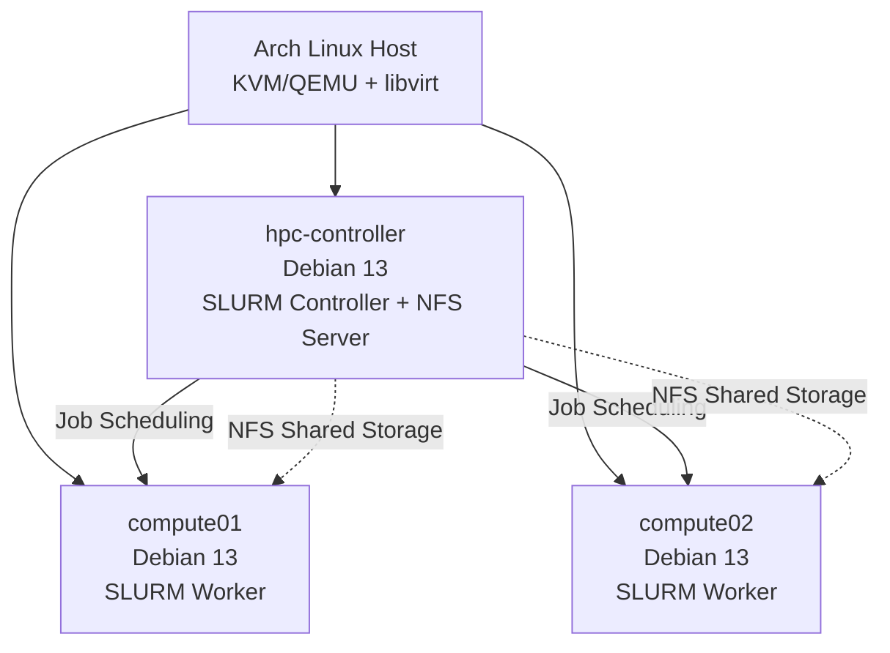

# Debian HPC Operations Lab

**A three-node Debian high-performance computing (HPC) lab built to practice Linux systems administration, SLURM job scheduling, shared storage, troubleshooting, and cluster maintenance.**

## Overview

I built this lab on my Arch Linux laptop using KVM/QEMU and libvirt. The cluster consists of one controller and two compute nodes running Debian 13.

The goal was to get hands-on experience with the technologies used to manage HPC environments. Rather than just setting up the cluster, I wanted to understand how jobs are scheduled, how resources are managed, and how to identify and recover from problems when they occur.

## Architecture

## What it demonstrates

- **Linux administration:** Configured and managed three Debian servers, including networking, SSH, services, and user permissions.
- **HPC job scheduling:** Used SLURM to submit jobs across compute nodes, monitor job states, manage resource allocation, and cancel jobs.
- **Shared storage:** Configured NFS so compute nodes could access shared files and write job results.
- **Authentication:** Configured MUNGE to authenticate communication between cluster nodes.
- **Troubleshooting:** Simulated a worker service outage, investigated logs and node status, and restored operation.
- **Cluster maintenance:** Drained a compute node, safely rebooted it, verified its services, and returned it to operation.

## Technologies

Debian 13 · Linux · SLURM · MUNGE · NFS · Bash · Python · SSH · KVM/QEMU · libvirt

## Project scope

This is a small, fully virtualized learning environment. It focuses on fundamental cluster administration and operational troubleshooting.

The complete technical write-up documents the configuration steps, commands, troubleshooting, and verification results.
