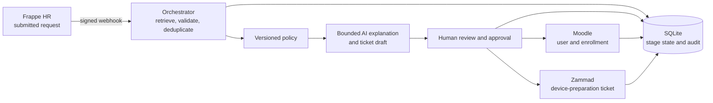
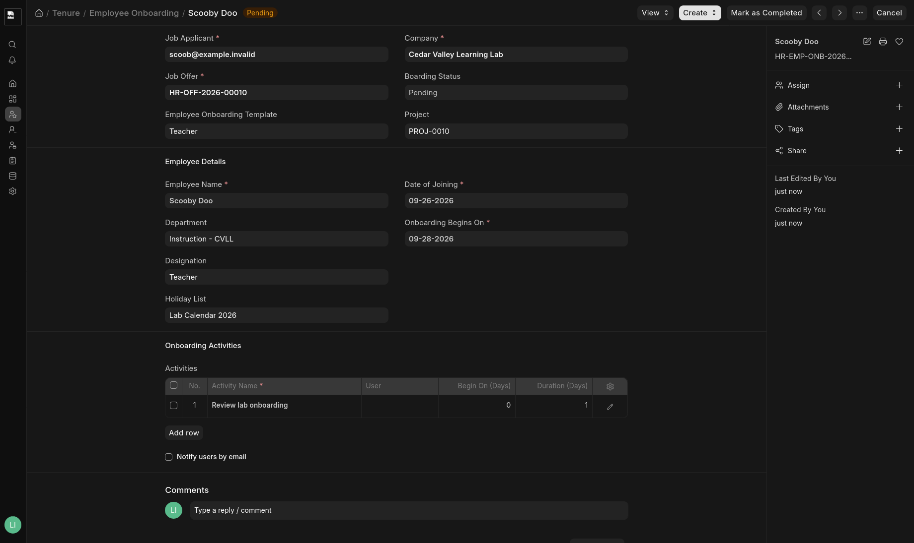
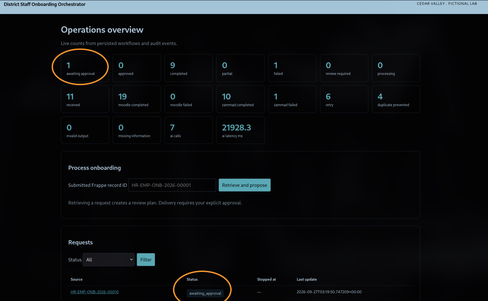
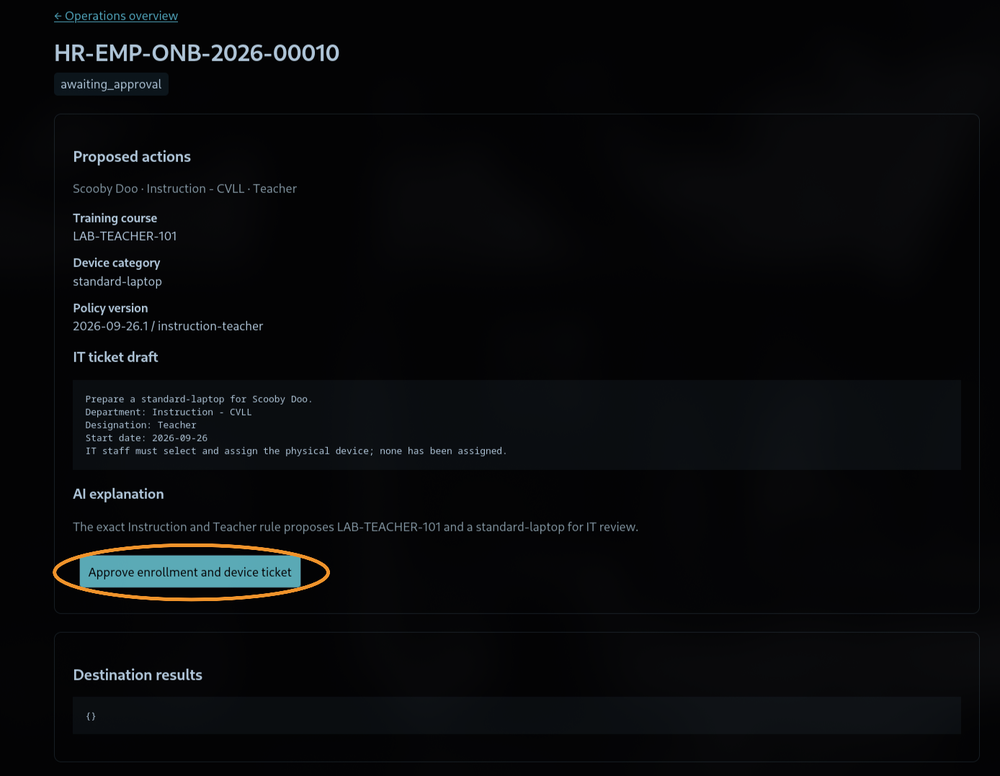
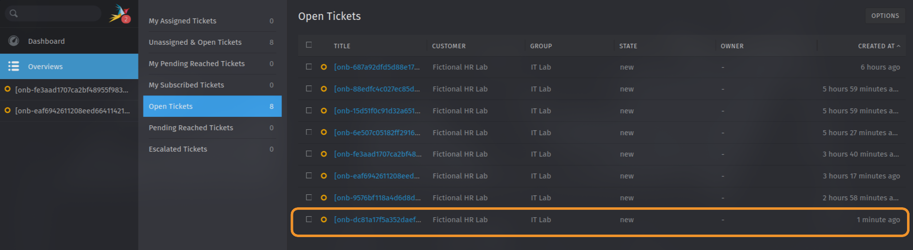
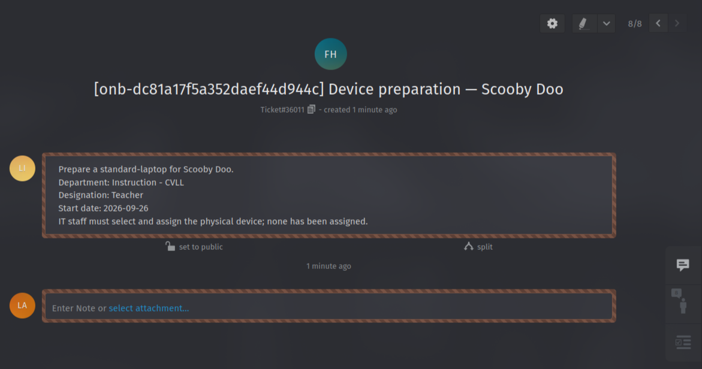
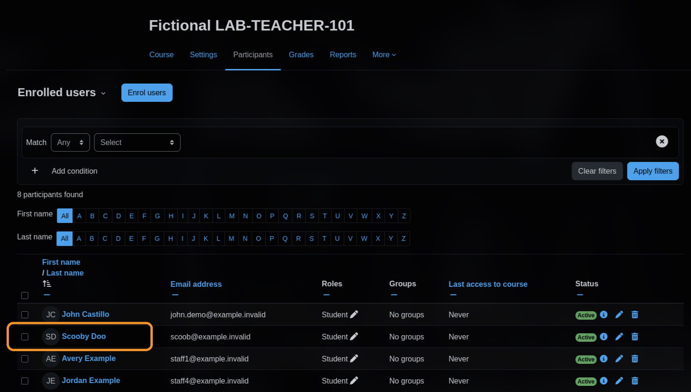

**A local portfolio project that coordinates fictional employee onboarding across Frappe HR, Moodle, and Zammad with policy-based recommendations, human approval, and safe recovery from partial failures.**

[View the source on GitHub](https://github.com/johncraigcastillo/district-staff-onboarding-orchestrator)

## The workflow

A submitted Employee Onboarding request in Frappe triggers the orchestrator. It retrieves and validates the authoritative HR record, applies a versioned policy, and prepares a review plan. A reviewer must approve that plan before the orchestrator creates a Moodle user and course enrollment or a Zammad device-preparation ticket.

## What it demonstrates

- **Enterprise API integration:** Frappe HR is the source; Moodle and Zammad are real local destination applications with separate API clients.
- **Controlled automation:** Exact department/designation policy matches determine proposed training and device categories. Unknown or conflicting values stop for review.
- **Human approval:** No Moodle enrollment or Zammad ticket is created before a reviewer approves the recorded plan.
- **Bounded runtime AI:** A local model explains the policy result, flags missing information, and drafts approved ticket text. Python validates its structured response; policy remains authoritative, and the model has no destination credentials or write access.
- **Reliable delivery:** Repeated events are deduplicated. If one destination succeeds and another fails, the successful result is retained and retry resumes the incomplete stage. Uncertain writes are reconciled before another write is attempted.
- **Operational visibility:** A reviewer dashboard, per-stage state, audit history, health endpoint, and access-restricted structured logs make outcomes and failures inspectable.

## Screenshots and demo

This example follows Scooby Doo, a fictional teacher, from an HR onboarding record to a reviewed plan, a device-preparation ticket, and a training enrollment.

### 1. HR onboarding record

Frappe HR holds the onboarding details used by the workflow: the employee name, department, designation, and onboarding dates. The orchestrator retrieves the record through Frappe’s API before preparing a plan.

### 2. Request awaiting approval

The operations dashboard shows the request awaiting review. Retrieving a record prepares a proposal; it does not enroll the employee or create a ticket.

### 3. Proposed actions and human review

The reviewer can inspect the policy-selected course, device category, AI explanation, and ticket draft before approving delivery. In this case, the teacher rule proposes `LAB-TEACHER-101` and a standard laptop preparation request.

### 4. Device ticket in Zammad

After approval, the workflow creates a device-preparation ticket in Zammad. The ticket appears in the IT Lab queue.

### 5. Ticket details

The ticket carries the approved preparation request and states that IT staff must select and assign the physical device. The workflow does not assign a device itself.

### 6. Training enrollment in Moodle

The fictional employee appears as an active participant in the `LAB-TEACHER-101` course, showing the result of the Moodle API integration.

## Engineering choices

The orchestrator is written in Python with FastAPI and SQLite. Docker Compose runs the local application stack. Frappe webhooks are HMAC-verified; destination writes use their applications' APIs. The plan digest ties approval to the reviewed proposal, and stored events support the dashboard rather than hard-coded demonstration counts.

The design deliberately separates **recommendation** from **authorization**: deterministic policy selects the permitted course and device category, AI can explain and format that result, and a human reviewer authorizes delivery. IT staff still select and assign any physical device.

## Evaluation and verification

The project includes **27 automated tests** covering policy, AI response validation, approval gates, duplicate delivery, API behavior, logging, and retry/reconciliation. The local end-to-end demo uses real Frappe, Moodle, and Zammad APIs with fictional records.

An evaluation compared two prompt approaches over 24 fictional cases. Prompt-only outputs failed the validation contract on all 24 cases. Supplying the deterministic policy result and a constrained response schema produced 24 valid grounded outputs. This measures structured contract following; it does not establish independent policy reasoning. See the [evaluation report](evaluation.md) and stored [recovery evidence](recovery-evidence.json) for the measured results and partial-failure retry scenario.

## Technology

Python · FastAPI · SQLite · Docker Compose · Frappe HRMS · Moodle · Zammad · Ollama · Qwen2.5

## Scope and limitations

- All employee, organization, course, and ticket data is fictional and intended for local demonstration.
- The project is not connected to a school district's systems and makes no claim of district approval or compliance.
- Moodle accounts are created for the local lab; this demo does not implement employee password provisioning or production identity management.
- Zammad tickets request device preparation. The application does not assign or track a physical device.
- The AI component is optional, local, policy-grounded, and subordinate to validation and human approval.

## Project links

- [GitHub source](https://github.com/johncraigcastillo/district-staff-onboarding-orchestrator)
