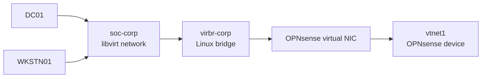
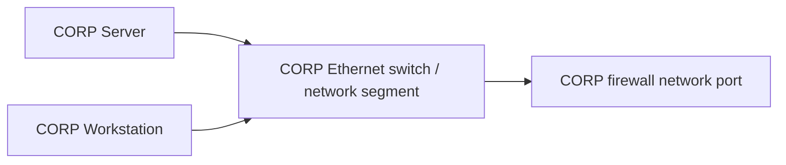

## Context

After removing the existing DC01 and WKSTN01 virtual machines, I decided to also remove the existing CORP network configuration so I could rebuild and document that layer of the environment from scratch.

The other lab segments and their systems will remain unchanged.

## Objective

Remove the existing CORP network configuration from both OPNsense and libvirt without affecting the DMZ, SECURITY, ATTACK, or WAN networks.

The CORP network will later be rebuilt as `10.10.10.0/24` and used for the new DC01 and WKSTN01 systems.

## Environment

- System involved: OPNsense
- Network / segment: CORP — `10.10.10.0/24`
- Libvirt network: `soc-corp`
- Virtual bridge: `virbr-corp`
- Tools: libvirt, virsh, OPNsense web interface
- Networks being preserved: `soc-dmz`, `soc-security`, `soc-attack`, and `default`

## What I Did

### 1. Identified the existing OPNsense network interfaces

Before removing the CORP network, I checked the OPNsense VM's virtual network interfaces so I could identify the exact interface attached to `soc-corp` and avoid affecting the other lab segments.

```sh
❯ virsh -c qemu:///system domiflist opnsense
 Interface   Type      Source         Model    MAC
------------------------------------------------------------------
 -           network   default        virtio   52:54:00:f9:39:18
 -           network   soc-corp       virtio   52:54:00:f1:30:8b
 -           network   soc-dmz        virtio   52:54:00:58:92:91
 -           network   soc-security   virtio   52:54:00:56:19:91
 -           network   soc-attack     virtio   52:54:00:f3:d6:f7
```

### 2. Started OPNsense and located the CORP interface

I started the OPNsense VM and opened its web interface so I could identify the interface associated with the existing `soc-corp` network.

```sh
❯ virsh -c qemu:///system start opnsense
Domain 'opnsense' started
```

I then opened the OPNsense interface at `10.10.10.1` and navigated to the interface assignments page.

### 2. Identified the CORP interface in OPNsense

I opened the OPNsense interface assignments page and matched the `soc-corp` virtual NIC to its OPNsense interface using the MAC address.

![[opnsense-interfaces-assignments.png]]

The CORP network was attached as:

- Identifier: `lan`
- Description: `LAN`
- Device: `vtnet1`
- MAC: `52:54:00:f1:30:8b`

This confirmed that the OPNsense `LAN` interface was the interface connected to the `soc-corp` libvirt network.

### 3. Backed up the OPNsense configuration

Before removing the existing CORP network configuration, I downloaded a copy of the current OPNsense configuration so I would have a rollback point if needed.

The backup was saved to the external SSD and verified:

```sh
❯ eza -lh /mnt/ssk-ssd/backups

Permissions Size User         Date Modified Name
.rw-r--r--   45k johncastillo  9 Sep 21:47  config-opnsense.internal-20260909214719.xml
drwx------     - johncastillo 30 Aug 19:45  DC01-Mystery-Inc-audit-baseline-20260830
drwxr-xr-x     - johncastillo  2 Aug 22:22  DC01-post-AD-baseline-20260802
.rw-r--r--   690 johncastillo  5 Sep 14:53  SOURCE-SHA256-VERIFICATION-20260905.txt
```

### 4. Unlocked the OPNsense LAN interface for removal

The existing CORP network was attached to OPNsense as the `LAN` interface, and OPNsense had interface removal protection enabled.

I edited the `LAN` assignment and disabled the **Lock** option so the interface could be removed.

After removing the `LAN` interface, the OPNsense WebGUI at `10.10.10.1` became unreachable because that IP address was assigned to the interface I had just removed. My host no longer had a network path to OPNsense through the CORP network.

### 5. Detached the CORP virtual NIC from OPNsense

Before removing the `soc-corp` libvirt network, I verified that the network was still active and checked whether any virtual machines were still attached to it.

```sh
❯ virsh -c qemu:///system net-info soc-corp
Name:           soc-corp
UUID:           4614aa7f-dc63-4535-a7c1-1cd21226bb19
Active:         yes
Persistent:     yes
Autostart:      yes
Bridge:         virbr-corp

❯ for vm in $(virsh -c qemu:///system list --all --name); do
  echo "=== $vm ==="
  virsh -c qemu:///system domiflist "$vm" | grep soc-corp || true
done

=== opnsense ===
 vnet1       network   soc-corp       virtio   52:54:00:f1:30:8b
=== KALI01 ===
=== WEB01 ===
```

The results showed that OPNsense was the only remaining VM attached to `soc-corp`.
I then confirmed the full OPNsense interface mapping and identified the CORP NIC by its MAC address:

```sh
❯ virsh -c qemu:///system domiflist opnsense

 Interface   Type      Source         Model    MAC
------------------------------------------------------------------
 vnet0       network   default        virtio   52:54:00:f9:39:18
 vnet1       network   soc-corp       virtio   52:54:00:f1:30:8b
 vnet2       network   soc-dmz        virtio   52:54:00:58:92:91
 vnet3       network   soc-security   virtio   52:54:00:56:19:91
 vnet4       network   soc-attack     virtio   52:54:00:f3:d6:f7
```

I removed only the NIC connected to `soc-corp`, using its MAC address to avoid affecting the other OPNsense interfaces.

```sh
❯ sudo virsh -c qemu:///system detach-interface opnsense network \
  --mac 52:54:00:f1:30:8b \
  --live \
  --config

Interface detached successfully
```

The `--live` option removed the NIC from the currently running OPNsense VM, while `--config` also removed it from the persistent VM definition.

I then verified that the `soc-corp` interface was gone and that the WAN, DMZ, SECURITY, and ATTACK interfaces remained attached.

```sh
❯ virsh -c qemu:///system domiflist opnsense

 Interface   Type      Source         Model    MAC
------------------------------------------------------------------
 vnet0       network   default        virtio   52:54:00:f9:39:18
 vnet2       network   soc-dmz        virtio   52:54:00:58:92:91
 vnet3       network   soc-security   virtio   52:54:00:56:19:91
 vnet4       network   soc-attack     virtio   52:54:00:f3:d6:f7
```


### So where are we?

At this point, the CORP side of the lab has been mostly dismantled.

The virtual setup looked like this:



Its physical-world equivalent is roughly:



The important equivalencies are:

- `soc-corp` = the libvirt definition of the CORP virtual network
- `virbr-corp` = the Linux bridge that carries traffic for that network
- OPNsense virtual NIC / `vtnet1` = the firewall's network port
    

At this point, the OPNsense CORP virtual NIC has been removed. DC01 and WKSTN01 were already removed previously.

The remaining piece is the unused `soc-corp` network and its `virbr-corp` bridge.

## Verification

How I confirmed the result worked.

- Command / query:
- Expected result:
- Actual result:

## Issues and Troubleshooting

What went wrong, what I checked, and how I resolved it.

_Omit this section if there were no meaningful issues._

## What I Learned

- 
- 
- 

## Next Step

What this enables or what I plan to do next.