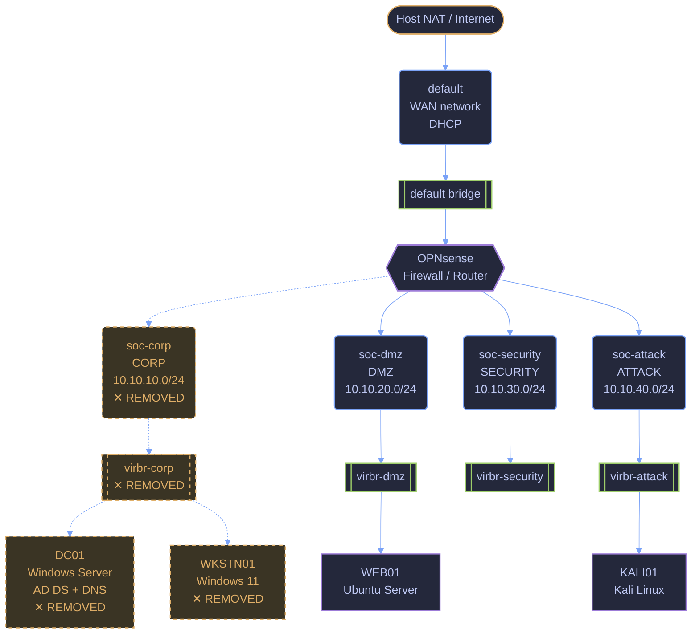

## Context

After removing the old CORP network configuration, I am rebuilding the network from scratch so I can better understand how libvirt, the Linux bridge, and OPNsense work together.

## Objective

Rebuild the CORP `10.10.10.0/24` network and reconnect it to OPNsense without affecting the other lab segments.

The completed network will provide the foundation for rebuilding DC01 and WKSTN01 afterward.

## Environment

- System involved: OPNsense
- Network / segment: CORP - `10.10.10.0/24`
- Planned libvirt network: `soc-corp`
- Planned Linux bridge: `virbr-corp`
- Tools: KVM/QEMU, libvirt, virsh, OPNsense

## Starting State of the Lab



## What I Did

### 1. Created the `soc-corp` libvirt network definition

#### Created a new libvirt network definition for the CORP segment using an XML file.

```sh
❯ nvim /tmp/soc-corp.xml      
```

```xml
<network>
  <name>soc-corp</name>
  <bridge name='virbr-corp' stp='on' delay='0'/>
</network>
```

The XML defines:
- `<name>soc-corp</name>` - the name libvirt will use for the CORP virtual network.
- `<bridge name='virbr-corp' ... />` - tells libvirt to create the Linux bridge that will carry traffic for this network.
- `stp='on'` - enables Spanning Tree Protocol on the bridge to help prevent Layer 2 loops.
- `delay='0'` - removes the normal forwarding delay so the bridge can begin passing traffic immediately.

I initially did not include an IP address, DHCP, NAT, or routing configuration. OPNsense would provide network services for CORP. A host-side management address was added later so the Arch host could directly administer OPNsense.

#### Added the XML definition to libvirt:

```sh
❯ sudo virsh -c qemu:///system net-define /tmp/soc-corp.xml
Network soc-corp defined from /tmp/soc-corp.xml
```
`net-define` saved `soc-corp` as a persistent libvirt network but did not start it yet.

#### Started the network:

```sh
❯ sudo virsh -c qemu:///system net-start soc-corp
Network soc-corp started
```
Starting the network activated `soc-corp` and created its `virbr-corp` Linux bridge.

#### Enabled Autostart
```sh
❯ sudo virsh -c qemu:///system net-autostart soc-corp
Network soc-corp marked as autostarted
```
This ensures the CORP network starts automatically with libvirt after a reboot.

#### Verified the Network State
```sh
❯ virsh -c qemu:///system net-info soc-corp
Name:           soc-corp
UUID:           50fcec54-e140-4125-adb3-dc4ef2c8757f
Active:         yes
Persistent:     yes
Autostart:      yes
Bridge:         virbr-corp
```
The result confirmed that `soc-corp` was active, persistent, configured to autostart, and using the expected `virbr-corp` bridge.

### 2. Verified the `virbr-corp` Linux bridge

After starting `soc-corp`, I confirmed that libvirt created the expected `virbr-corp` Linux bridge on the host.

```sh
❯ ip link show virbr-corp
8: virbr-corp: <NO-CARRIER,BROADCAST,MULTICAST,UP> mtu 1500 qdisc htb state DOWN mode DEFAULT group default qlen 1000
    link/ether 52:54:00:2c:d7:d7 brd ff:ff:ff:ff:ff:ff
```

- `virbr-corp` - the Linux bridge created for the CORP network.
- `UP` - the bridge is enabled.
- `NO-CARRIER` - nothing is connected to the bridge yet, which is expected at this stage.
- `state DOWN` - there is currently no active link carrying traffic.
- `mtu 1500` - the bridge is using the standard Ethernet MTU.
- `52:54:00:2c:d7:d7` - the bridge's MAC address.

This confirmed that the bridge was created successfully and was ready for a virtual NIC to be attached.

### 3. Attached the CORP network to OPNsense

After creating and verifying `soc-corp`, I attached a new virtual NIC to the OPNsense VM so the firewall could connect to the CORP network.

```sh
❯ sudo virsh -c qemu:///system attach-interface opnsense network soc-corp --model virtio --live --config
Interface attached successfully
```

The options used were:

- `opnsense` - the target virtual machine.
- `network soc-corp` - connects the new NIC to the `soc-corp` libvirt network.
- `--model virtio` - uses the paravirtualized VirtIO network adapter.
- `--live` - applies the change to the currently running VM.
- `--config` - saves the change to the persistent VM configuration.

I then verified the OPNsense interfaces:

```sh
❯ virsh -c qemu:///system domiflist opnsense

 Interface   Type      Source         Model    MAC
-------------------------------------------------------------
 vnet0       network   default        virtio   52:54:00:f9:39:18
 vnet1       network   soc-dmz        virtio   52:54:00:58:92:91
 vnet2       network   soc-security   virtio   52:54:00:56:19:91
 vnet3       network   soc-attack     virtio   52:54:00:f3:d6:f7
 vnet4       network   soc-corp       virtio   52:54:00:5f:2c:10
```

This confirmed that OPNsense now had a virtual NIC connected to `soc-corp`.

The host-side `vnet4` name is the TAP interface created by libvirt and does not correspond directly to OPNsense's internal `vtnet` numbering. I used the NIC's MAC address, `52:54:00:5f:2c:10`, to identify the CORP adapter inside OPNsense.

At this stage, the NIC was attached at the virtualization layer, but the CORP interface had not yet been assigned or configured inside OPNsense.

### 4. Added a temporary management IP to the CORP bridge

After attaching OPNsense to `soc-corp`, I checked `virbr-corp` and found that the Arch host did not yet have an IP address on the CORP subnet.

```sh
❯ ip addr show virbr-corp
7: virbr-corp: <BROADCAST,MULTICAST,UP,LOWER_UP> mtu 1500 qdisc htb state UP group default qlen 1000
    link/ether 52:54:00:2c:d7:d7 brd ff:ff:ff:ff:ff:ff
```

I temporarily assigned `10.10.10.2/24` to the bridge:

```sh
❯ sudo ip addr add 10.10.10.2/24 dev virbr-corp
```

This was not required for OPNsense or the CORP network to function. It was an optional management configuration that placed the Arch host directly on the CORP subnet so it could later access the OPNsense WebGUI at `10.10.10.1`.

I verified the address:

```sh
❯ ip addr show virbr-corp
7: virbr-corp: <BROADCAST,MULTICAST,UP,LOWER_UP> mtu 1500 qdisc htb state UP group default qlen 1000
    link/ether 52:54:00:2c:d7:d7 brd ff:ff:ff:ff:ff:ff
    inet 10.10.10.2/24 scope global virbr-corp
       valid_lft forever preferred_lft forever
```

Because this was added manually with `ip`, it would not survive a reboot or recreation of the bridge.

### 5. Made the Arch host management IP persistent

After confirming that `10.10.10.2/24` worked as the host management address, I added it to the persistent `soc-corp` libvirt network definition.

```sh
❯ sudo EDITOR=nvim virsh -c qemu:///system net-edit soc-corp
Network soc-corp XML configuration edited.
```

I added:

```xml
<dns enable='no'/>
<ip address='10.10.10.2' prefix='24'/>
```

This gives the Arch host a persistent `10.10.10.2/24` address on `virbr-corp`. No libvirt DHCP or NAT was configured, and DNS was explicitly disabled. OPNsense remains the intended gateway, firewall, router, DHCP server, and DNS path for CORP clients.

I restarted `soc-corp` to apply the updated definition:

```sh
❯ sudo virsh -c qemu:///system net-destroy soc-corp
Network soc-corp destroyed

❯ sudo virsh -c qemu:///system net-start soc-corp
Network soc-corp started
```

I then confirmed the bridge retained the address:

```sh
❯ ip -br addr show virbr-corp
virbr-corp       DOWN           10.10.10.2/24
```

The bridge showed `DOWN` while OPNsense was powered off. After OPNsense was started again, the link became active while keeping `10.10.10.2/24`.

### 6. Configured the CORP interface in OPNsense

I assigned the new CORP NIC inside OPNsense and configured it as the LAN/CORP interface.

The interface was set to:
- Device: `vtnet1`
- IPv4 address: `10.10.10.1`
- Prefix: `/24`
- Upstream gateway: none
- IPv6: disabled
- DHCP: left disabled for now
- WebGUI: kept on HTTPS

Before accepting the interface reassignment, I verified that the existing segment mappings were preserved and that the new CORP adapter matched the expected MAC address:

- WAN → `vtnet0`
- CORP / LAN → `vtnet1`
- DMZ → `vtnet2`
- SECURITY → `vtnet3`
- ATTACK → `vtnet4`

The CORP adapter was identified by MAC address `52:54:00:5f:2c:10`, matching the `soc-corp` NIC attached through libvirt.

After applying the settings, I confirmed that the OPNsense WebGUI was reachable again at:

`https://10.10.10.1`

This verified that the CORP interface was active and that the Arch host at `10.10.10.2` could communicate with OPNsense over the rebuilt CORP network. The other interface assignments were preserved during the change.

### 7. Configured DHCP for the CORP network

After confirming that the CORP interface was reachable at `10.10.10.1/24`, I configured OPNsense to provide DHCP leases to CORP clients.

I added a DHCP range on the `LAN` interface with:

```text
Start address: 10.10.10.100
End address:   10.10.10.199
Lease time:    86400 seconds
Description:   CORP DHCP range
```

![[lan-dhcp-rang.png]]

This keeps the lower part of the subnet available for statically addressed infrastructure and management systems, including:

```text
10.10.10.1   OPNsense CORP gateway
10.10.10.2   Arch host management address
```

The DHCP service remains hosted by OPNsense rather than libvirt. No libvirt DHCP service was configured for `soc-corp`.

After saving and applying the configuration, I confirmed that the CORP DHCP range remained present in OPNsense as:

```text
10.10.10.100 - 10.10.10.199
```

The next step is to validate the configuration by connecting a temporary client to `soc-corp` and confirming that it receives a valid lease from OPNsense.

### 8. Validated CORP DHCP with a temporary client

To verify DHCP before rebuilding WKSTN01, I created a temporary Linux network namespace connected to `virbr-corp`.

The test client successfully received:

```text
IP address:      10.10.10.125/24
DHCP server:     10.10.10.1
Default gateway: 10.10.10.1
Lease time:      86400 seconds
```

Key DHCP output:

```text
offered 10.10.10.125 from 10.10.10.1
acknowledged 10.10.10.125 from 10.10.10.1
leased 10.10.10.125 for 86400 seconds
adding default route via 10.10.10.1
```

This confirmed that OPNsense was successfully providing DHCP on CORP and assigning addresses from the intended pool.

I then tested connectivity to the gateway:

```sh
sudo ip netns exec corp-test ping -c 4 10.10.10.1
```

The ping failed with 100% packet loss, indicating DHCP was working but CORP firewall/reachability still needed to be configured and tested.

### 9. Verified CORP gateway reachability

The temporary CORP client initially could not ping `10.10.10.1` because no LAN firewall rules existed.

I added a narrowly scoped OPNsense rule allowing IPv4 ICMP Echo Requests from the CORP network to the CORP gateway:

```text
Action:      Pass
Interface:   LAN
Protocol:    ICMP
ICMP type:   Echo Request
Source:      LAN network
Destination: LAN address
```

I then repeated the test:

```sh
sudo ip netns exec corp-test ping -c 4 10.10.10.1
```

Result:

```text
4 packets transmitted, 4 received, 0% packet loss
```

This confirmed that the temporary CORP client could obtain a DHCP lease and successfully reach the OPNsense gateway.

Broader CORP firewall and inter-segment access rules will be configured and tested separately.

### 10. Removed the temporary DHCP test client

After validating DHCP and gateway reachability, I removed the temporary network namespace and veth pair used for testing:

```sh
sudo ip netns del corp-test
sudo ip link del ctest-h
```

I verified the cleanup:

```sh
ip netns list
ip link show ctest-h
```

Result:

```text
Device "ctest-h" does not exist.
```

No temporary test namespace or veth interface remained on the host.

## Verification
I confirmed the rebuilt CORP network was working by validating each layer:

- `soc-corp` was active, persistent, and set to autostart.
- `virbr-corp` existed and retained the Arch host management address `10.10.10.2/24`.
- OPNsense was reachable at `10.10.10.1`.
- The CORP interface was correctly mapped to `vtnet1`.
- A temporary client received `10.10.10.125/24` from OPNsense DHCP.
- The client received `10.10.10.1` as its default gateway.
- After adding the ICMP rule, the client successfully reached the gateway with 0% packet loss.
- The temporary test namespace and veth interfaces were removed after validation.
## Issues and Troubleshooting

The temporary CORP client initially received a valid DHCP lease but could not ping `10.10.10.1`.

Because addressing and DHCP were working, I checked the OPNsense LAN firewall rules and found that no LAN rules had been defined. OPNsense was therefore blocking incoming CORP traffic by default.

I added a narrowly scoped rule allowing IPv4 ICMP Echo Requests from `LAN network` to `LAN address`. After applying the rule, the same ping test succeeded with 4 of 4 replies.

I also encountered an interface-name error while creating the temporary test client because Linux interface names are limited in length. I resolved it by using shorter veth names.

During DHCP testing, running `dhcpcd` inside the temporary network namespace unexpectedly rewrote the host's `/etc/resolv.conf`, breaking DNS resolution on the Arch host. Internet routing still worked, confirmed by successful pings to `1.1.1.1`, while hostname lookups failed. I restored DNS by repopulating `/etc/resolv.conf` with the configured resolvers and confirmed recovery by successfully resolving and pinging `google.com`.

## What I Learned
- A libvirt network, Linux bridge, host TAP interface, virtual NIC, and OPNsense interface are separate layers of the same virtual network path.
- MAC addresses are more reliable than interface numbering when matching a libvirt NIC to its corresponding interface inside a VM.
- A Linux bridge does not require a host IP to function; `10.10.10.2/24` was added only to provide convenient host-side management access.
- Successful DHCP does not prove general connectivity. Addressing, routing, and firewall policy must be tested separately.
- OPNsense blocks traffic by default when no interface pass rules exist, so firewall behavior should be validated rather than assumed.

## Next Step
The CORP network is now ready to support infrastructure systems.

The next entry will configure and validate the broader CORP firewall and inter-segment access policy before rebuilding DC01 and WKSTN01.
