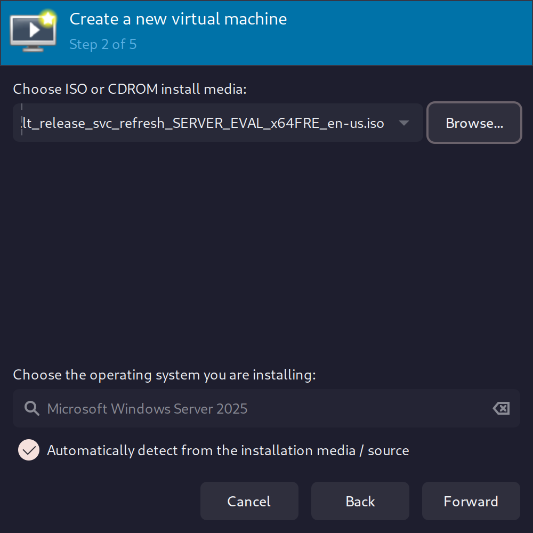
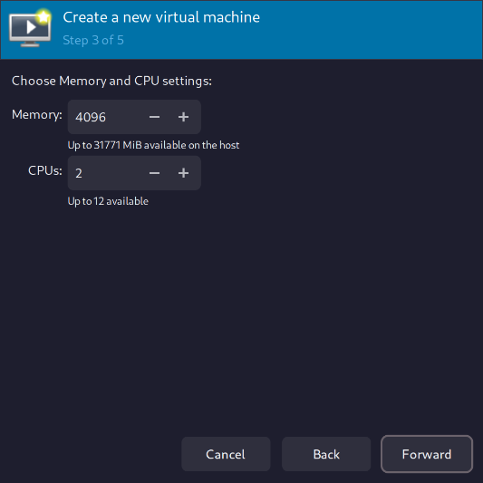
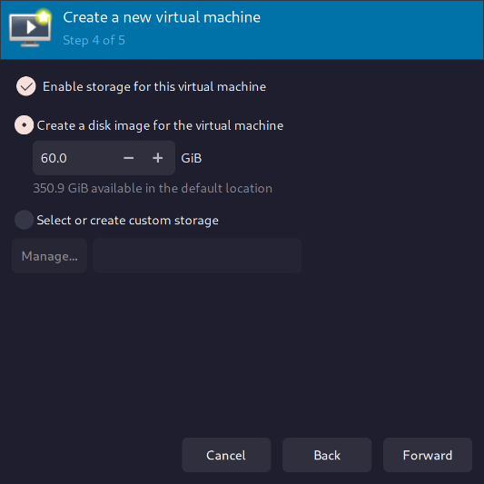
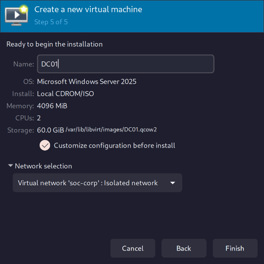
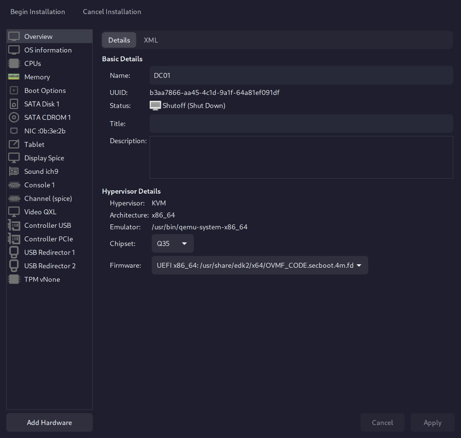

---
title:
date: "2026-09-24"
type: technical-writeup
status: draft
tags:
  - portfolio
---

## Context

The CORP network has been rebuilt and is ready for Windows infrastructure again. DC01 was removed earlier so I could rebuild the environment more deliberately and better understand each part of the setup.

## Objective

Rebuild DC01 as the Windows Server system for the CORP network and prepare it to provide Active Directory Domain Services and DNS for the lab.

## Environment

- Systems involved: OPNsense, DC01
- Network / segment: CORP - `10.10.10.0/24`
- Tools: KVM/QEMU, libvirt, virt-manager, Windows Server
- Dependencies:
  - `soc-corp` is active
  - OPNsense CORP interface is `10.10.10.1/24`
  - CORP DHCP is working
  - Arch host can manage OPNsense at `10.10.10.1`

## What I Did

### 1. Checked the lab before rebuilding DC01

Before creating the new DC01 virtual machine, I checked the current lab state to make sure the old DC01 had been fully removed and the CORP network was ready.

I checked the existing virtual machines:

```sh
virsh -c qemu:///system list --all
```

Result:

```text
Id   Name       State
---------------------------
-    KALI01     shut off
-    opnsense   shut off
-    WEB01      shut off
```

This confirmed there was no existing `DC01` virtual machine.

I checked the current VM disks:

```sh
ls -lh /var/lib/libvirt/images
```

Result:

```text
KALI01.qcow2
opnsense.qcow2
WEB01.qcow2
```

This confirmed there was no old `DC01.qcow2` disk left behind.

I located the Windows Server installation ISO on the external SSD:

```sh
find /mnt/ssk-ssd -type f \( -iname '*server*.iso' -o -iname '*windows*.iso' \) 2>/dev/null
```

Result:

```text
/mnt/ssk-ssd/installation-media/26100.32230.260111-0550.lt_release_svc_refresh_SERVER_EVAL_x64FRE_en-us.iso
```

Finally, I checked the lab networks:

```sh
virsh -c qemu:///system net-list --all
```

Result:

```text
Name           State    Autostart   Persistent
-------------------------------------------------
default        active   yes         yes
soc-attack     active   yes         yes
soc-corp       active   yes         yes
soc-dmz        active   yes         yes
soc-security   active   yes         yes
```

This confirmed that `soc-corp` was active, persistent, and set to autostart.

With the old DC01 removed, the Windows Server ISO available, and the CORP network ready, the lab was in a clean state to begin rebuilding DC01.

### 2. Started OPNsense for the DC01 rebuild

Before creating DC01, I started OPNsense so the CORP network would have its gateway and network services available.

```sh
virsh -c qemu:///system start opnsense
```

Result:

```text
Domain 'opnsense' started
```

I then checked the VM state:

```sh
virsh -c qemu:///system list --all
```

Result:

```text
Id   Name       State
---------------------------
1    opnsense   running
-    KALI01     shut off
-    WEB01      shut off
```

This confirmed that OPNsense was running while the other lab VMs stayed powered off to keep resource use low.

### 3. Created the new DC01 virtual machine

I used virt-manager to create a new Windows Server virtual machine for DC01.

I selected the Windows Server 2025 installation ISO from the external SSD:

```text
/mnt/ssk-ssd/installation-media/26100.32230.260111-0550.lt_release_svc_refresh_SERVER_EVAL_x64FRE_en-us.iso

```



I configured the VM with:

```text
Name:    DC01
Memory:  4096 MiB
CPUs:    2
Storage: 60 GiB
Network: soc-corp

```





The virtual disk was created at:

```text
/var/lib/libvirt/images/DC01.qcow2
```

I attached DC01 to `soc-corp` so it would be placed on the CORP network with OPNsense handling routing and network services.

Before starting the Windows installation, I chose to customize the VM hardware so I could verify the firmware, storage, network adapter, and other settings first.



### 4. Reviewed the DC01 hardware before installation

Before starting Windows Server, I checked the virtual hardware to make sure DC01 was using the settings I wanted.



I confirmed:

```text
Chipset: Q35
Firmware: UEFI with Secure Boot
Memory: 4096 MiB
CPUs: 2
Disk: 60 GiB SATA
Network: soc-corp
NIC model: virtio
Display: SPICE
Video: QXL
TPM: Emulated
```

I also checked the boot order and set the Windows Server ISO to boot before the virtual hard disk:

```text
1. SATA CDROM 1
2. SATA Disk 1
```

This made sure the VM would start from the Windows Server installer first, while keeping the virtual hard disk ready for the operating system installation.

With the hardware checked and the boot order set, DC01 was ready to begin the Windows Server installation.

### 5. Installed Windows Server 2025 and checked the network adapter

I started the Windows Server installation and selected:

```text
Windows Server 2025 Standard Evaluation (Desktop Experience)
```

I chose the 60 GiB virtual disk as the installation target and let Windows complete the setup.

After installation finished, I set a password for the built-in `Administrator` account and logged in.

I then checked whether Windows could see the virtual network adapter:

```powershell
Get-NetAdapter
```

and:

```powershell
ipconfig /all
```

`Get-NetAdapter` returned no network adapter, and `ipconfig /all` only showed the basic Windows host information.

This showed that Windows Server did not yet have a driver for the VirtIO network adapter.

I checked my host running the VM for an existing VirtIO driver ISO:

```sh
find /mnt/ssk-ssd /var/lib/libvirt -type f -iname '*virtio*.iso' 2>/dev/null
```

No VirtIO driver ISO was found.

I decided to keep the VirtIO network adapter and install the proper Windows driver instead of switching back to an emulated Intel adapter.

The next step will be to get the VirtIO driver ISO, attach it to DC01, install the network driver, and then verify that Windows can see the NIC and communicate on the CORP network.

## Verification

How I confirmed the result worked.

- Command / query:
- Expected result:
- Actual result:

## Issues and Troubleshooting

What went wrong, what I checked, and how I resolved it.

_Omit this section if there were no meaningful issues._

## What I Learned

-
-
-

## Next Step

What this enables or what I plan to do next.
