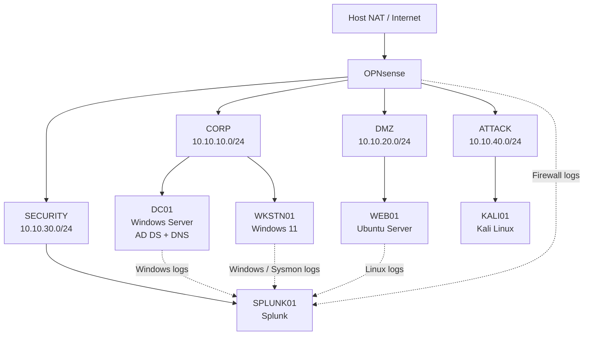

The Mystery Inc Enterprise IT & Security Lab runs locally on an Arch Linux host using KVM/QEMU and libvirt. OPNsense provides routing and firewall segmentation between separate CORP, DMZ, SECURITY, and ATTACK networks.

## Architecture

## Technology

| Area                      | Technology                             |
| ------------------------- | -------------------------------------- |
| Host OS                   | Arch Linux                             |
| Virtualization            | KVM, QEMU                              |
| VM management             | libvirt, virsh                         |
| Virtual disks             | qcow2                                  |
| Firewall / routing        | OPNsense                               |
| Windows server            | Windows Server                         |
| Directory services        | Active Directory DS, DNS, Group Policy |
| Windows endpoint          | Windows 11                             |
| Linux server              | Ubuntu Server                          |
| Security testing          | Kali Linux                             |
| SIEM                      | Splunk                                 |
| Automation                | PowerShell, Bash, Python               |
| Network analysis          | Wireshark                              |
| Future network monitoring | Suricata, Zeek                         |
## Design Notes

- OPNsense routes traffic between the lab networks.
- CORP, DMZ, SECURITY, and ATTACK are separate network segments.
- ATTACK and SECURITY are default-deny unless a specific exercise requires access.
- Active VM disks stay on the internal NVMe.
- Backups and installation media are stored on the external SSD.